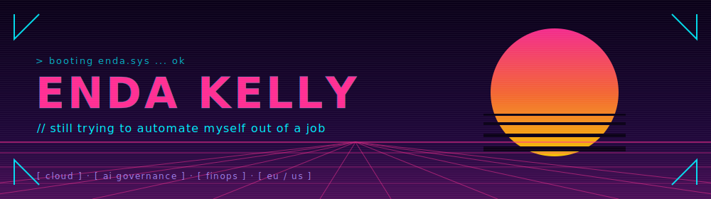

<picture>
  <source media="(prefers-color-scheme: dark)" srcset="./public/images/banner-dark.svg">
  <source media="(prefers-color-scheme: light)" srcset="./public/images/banner-light.svg">
  
</picture>

Cloud architect, AI governance nerd, and recovering FinOps optimist. I help companies govern AI, cut cloud bills, and modernise infra — for more details teleport straight to **[portfolio.cloudnua.com](https://portfolio.cloudnua.com)**. This page is the fun alter ego side, to which you are very much welcome.

In other breaking news:

> Pragmatic, lazy sysadmin. Survived the Room 101 mire of SRE / DevOps / platform engineering and came out the other side a believer in APIs, cron jobs, and the sheer, underrated brilliance that is `grep`.

---

## Enda as a Service — SLO dashboard

> SLOs for `enda-as-a-service`. Incident channel: **#enda-is-offline**. Error budget policy: aggressive.

| SLI                          | Target   | Current   | Error budget             |
| ---------------------------- | -------- | --------- | ------------------------ |
| Email response               | &lt; 24h | 19h       | 79% left                 |
| Coffee availability          | 99.9%    | 99.7%     | burning 🔥               |
| Job automated                | 100%     | 0%        | ∞                       |
| Meetings started on time     | &gt; 95% | 91%       | 20% left                 |
| PRs merged same day          | &gt; 80% | 74%       | 30% left                 |
| Git force-pushes per week    | &lt; 1   | 3         | personal branches, relax |
| Terraform plans read in full | &gt; 90% | 62%       | burning 🔥               |
| LLM context window respected | &lt; 80% | 200M/200M | one-shot or nothing      |

Status page is eventually consistent. Mostly eventually.

---

## Enda in production

### Terminal view

---

<b>Daily routine of a 99x software guru (allegedly)</b>

- **4:00 AM** — cold plunge / ice bath after mountain pass run. Visualise next quarter's OKRs.
- **4:30 AM** — read three whitepapers on quantum-AI synergy.
- **5:00 AM** — `opentofu plan`. Journal about it.
- **6:00 AM** — record a LinkedIn carousel about my morning guru routine so you don't have to.

Actually:

- **8:00 AM** — Coffee. Open laptop (ahem, command centre).
- **8:05 AM** — Token maxing / limits reached.
- **8:06 AM** — Switch to local Quantum AI Compute.
- **7:55 AM** — Multiverse traversal engaged. Branch B.
- **7:00 AM** — World domination complete (phew 😌, what took you so long?!) ✅
- **6:00 AM** — Back to bed. The 4 AM cold plunge happens to a previous-timeline me.

---

<b>What I actually use daily (stack dependant)</b>

- **Cloud & Infra** — Azure, AWS, GCP, Hetzner, CloudFlare, Kubernetes, OpenToFu, Ansible, Docker
- **Languages** — Python, TypeScript, Go, Rust (occasionally, cautiously)
- **Data & AI** — Postgres, Azure Storage Account, AWS S3, n8n, oh and a suspicious amount of prompt engineering 🤖
- **Tools** — VSCode, Cursor, WSL, ZSH, Claude Code, `curl`, `nc`, `vim`, `crontab`, `gh`, `jq`, `uv`, `bun`, `turborepo`, `next.js`, `react-native`

Yes, your eyes are correct — there's no 100-logo shield wall of every tool I've ever touched, in hopes each one trips some HR keyword filter. AI keeps shoving new frameworks into our laps faster than we can `git pull`...so please sir, how could you know so little? Not sure if I can `ssh` my way out of this one 😧

If it's not in this list, I'm probably not using it regularly or more likely I am just loosely coupled to strongly held opinions about tech stacks. Let us proceed accordingly to the multiverse as more often than not the `qubits` are working "...on my machine" just fine. 🔥

<b>Certifications</b>

- [AWS Certified DevOps Engineer – Professional](https://www.credly.com/badges/52a5e8ff-5cfa-4347-8f21-73ffe6cb1b59)
- [Microsoft Certified: DevOps Engineer Expert](https://learn.microsoft.com/en-us/users/enda-kelly/credentials/346e1e1caec72237)
- [GCP Professional Cloud Architect](https://www.credly.com/badges/41013bc3-5092-4490-940a-541a555f5a79)
- [CKA: Certified Kubernetes Administrator](https://www.credly.com/badges/4ef7a938-2f70-40d6-943e-8b50e8c38a1b)

> Full list with the other 16+ are on my portfolio. The exact count fluctuates with whichever vendor decided to rebrand this month.

---

### Where to find me

- **Real life:** building, tweaking & debugging the next "One more thing....", learning and being humbled by my lack of knowledge and of course writing the things you're reading.
- **LinkedIn:** mostly masquerading as a thought leader. Currently 47 likes deep into a thread about how `vim` changed my life and how it's about to change yours.
- **X / Twitter:** screenshotting my own posts back at myself for the algorithm.

